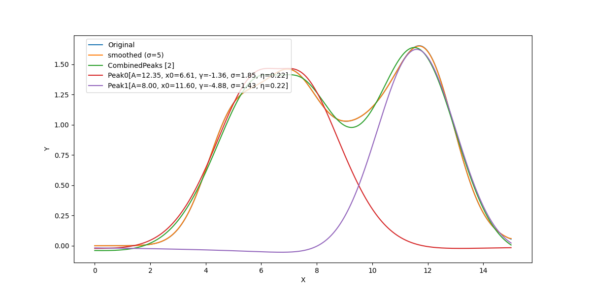

# PeakDeconvolution
此项目用于峰值解卷积，即从峰值信号中分离出单独的成分。它结合了数据预处理、峰值提取、以及伪伏依特峰（结合洛伦兹和高斯模型）的建模方法，使用梯度下降法进行求解，旨在提供准确的峰值识别和分析。
## 功能

1. **模型定义**：定义伪伏依特峰模型，结合洛伦兹和高斯模型来描述光谱或其他类型峰值的特性。
2. **模型图表展示**：通过可视化工具展示模型的峰值形状，帮助用户理解每个峰值的特点。
3. **数据预处理模块（DataPreprocess）**：对原始数据进行预处理，包括平滑处理，以减少噪声并改善峰值的识别。
4. **训练器**：提供模型训练工具，包括设置训练参数，执行训练循环等。
5. **模型初始解优化**：利用峰顶坐标确定伪伏依特峰模型中的A（高度）和x0（中心位置）的初始值。

## 使用方法
参阅`train.py`中的测试单元
```py
def test2():
    p = DataPreprocessor.from_csv(
        "datas/test-deconvolve.csv").smooth()
    train(preprocessor=p,
          epochs=200,
          batch_size=100,
          lr=0.001,
          device="cpu",
          seed=79)
```

## Figure

